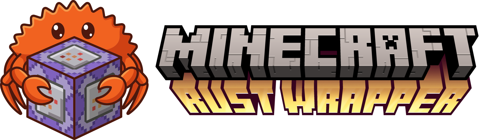

# Minecraft Rust Wrapper (MCRW)



A lightweight, high-performance middleware designed to wrap and manage Minecraft server instances. Written in **Rust**, it provides a robust event-driven architecture that allows users to extend server functionality using **Lua** scripts.

## Inspiration and Philosophy

This project draws significant architectural inspiration from **MCDReforged**.

MCDReforged set the standard for manipulating Minecraft server standard streams to implement custom logic. We aim to honor that legacy while exploring a different technical direction. By leveraging Rust's system-level capabilities, we hope to offer an alternative that prioritizes memory safety and raw performance, while maintaining the flexibility of a plugin ecosystem.

You can view the original MCDReforged project here: https://github.com/MCDReforged/MCDReforged

## Key Features

While sharing the same conceptual goal as its predecessors, this project introduces several distinct advantages driven by its technology stack:

* **High Performance & Low Footprint:** Built on Rust and the Tokio asynchronous runtime, the wrapper incurs negligible overhead. It handles high-frequency log parsing and I/O operations without impacting server tick rates.
* **Safe & Sandboxable Plugins:** Extensibility is powered by Lua 5.4 (via `mlua`). This allows for a clean separation between the core wrapper and user logic.
* **Robust Concurrency:** Utilizes Rust's ownership model and MPSC channels to safely handle user input, server output, and plugin commands simultaneously without race conditions.
* **Standardized Lua Environment:** Plugins are loaded into a single virtual machine with environment sandboxing. This ensures low memory usage while preventing plugins from polluting the global state or interfering with one another.
* **Regex-Driven Event Dispatch:** Efficiently monitors standard output (stdout) using pre-compiled regular expressions, triggering Lua callbacks only when specific patterns are matched.

## Getting Started

### Prerequisites

* Rust (latest stable toolchain)
* Java Runtime Environment (compatible with your target Minecraft server)
* A Minecraft server JAR file (e.g., `server.jar`)

### Installation

1. Clone the repository:
   ```bash
   git clone https://github.com/lxbme/MCRW.git
   cd MCRW
   ```

2. Build the project in release mode for optimal performance:
   ```bash
   cargo build --release
   ```

3. Place your `server.jar` in the root directory and ensure you have accepted the Minecraft EULA.

4. Place your plugins in `./lua_plugins/`.

### Usage

Run the wrapper directly via Cargo or by executing the binary:

```bash
cargo run --release -- -Xmx1024M -Xms1024M -jar server.jar nogui
```

The console Arguments will be passed to Java without any modification.

Once running, the wrapper will start the Minecraft server as a child process. You can interact with the server console directly through the terminal, and loaded Lua plugins will begin monitoring log output immediately.

## Plugin Development

Plugins are located in the `lua_plugins/` directory. Each plugin must have an `init.lua` entry point.

Example structure:

```
lua_plugins/
  my_plugin/
    init.lua
    utils.lua
    config.json
```

A simple plugin example:

```lua
-- plugins/my_plugin/init.lua

-- Use relative requiring for local modules
local utils = require( ... .. ".utils")

-- get rust wrapper instance
local wrapper = Server:get_context(...)

-- load config
local config = wrapper:load_config({
    color = "green",
    enable_hello = true
})

-- Register a regex listener
if config.enable_hello then
    wrapper:register(
        "\\[.*\\]: <(.*?)> !hello",
        function(line, player)
            wrapper:log("Received hello command from " .. player)
            
            local msg = utils.get_welcome_msg(player)
            
            return {
                "tellraw " .. player .. " {\"text\":\"" .. msg .. "\",\"color\":\"" .. config.color ..  "\"}",
                "playsound entity.experience_orb.pickup master " .. player
            }
        end
    )
end
```

Find more examples: https://github.com/lxbme/mcrw_lua_plugins

## Contributing

We are building a community-driven tool and welcome contributions from developers of all skill levels. Whether you are a Rustacean, a Lua scripter, a Minecraft server administrator, or even just a Minecraft enthusiasts, your input is valuable.

### Issue Tracking

If you encounter a bug, have a feature request, or notice a documentation error, please submit an issue on our GitHub Issue Tracker. When reporting bugs, please provide the server logs and the plugin code that caused the issue if applicable.

### Pull Requests

We actively welcome Pull Requests. If you are interested in fixing an issue or adding a new feature:

1. Fork the repository.
2. Create a new branch for your feature or fix.
3. Ensure your code follows standard Rust formatting (`cargo fmt`).
4. Submit a Pull Request with a clear description of the changes.

**All contributions are licensed under the GPLv3 license by default.**

### AI Code Policy

We acknowledge the utility of AI-based coding assistants (such as GitHub Copilot, ChatGPT, or Claude) in modern software development. Contributors are permitted to use these tools to assist with boilerplate generation, documentation, or logic implementation. However, **all AI-generated code must be manually reviewed and verified by the submitter.** Blindly copy-pasting code from AI tools is strictly prohibited. You accept full responsibility for the logic, security, and functionality of your contribution. Please ensure that any generated code adheres to the project's existing style and architecture before submitting a Pull Request.

## License

This project is licensed under the GPLv3 License. See the [LICENSE](./LICENSE) file for details.

